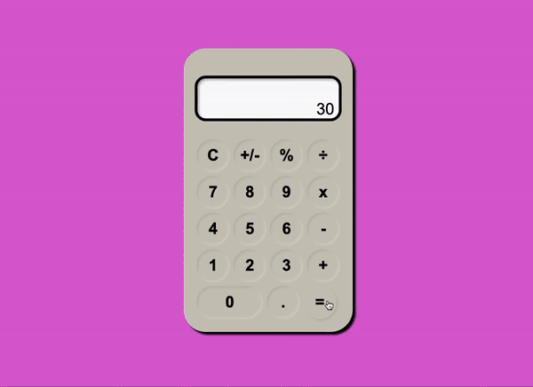

## Calculadora simples em React

<i>Projeto desenvolvido como desafio referente ao módulo 2 do curso Vai na Web de desenvolvimento front-end. </i>  

    
    
    
    

 

Nesse projeto, foi desenvolvida uma calculadora simplificada com `react class component`. Para estilização, iniciei meu aprendizado sobre `styled-components`.

#### Algumas funcionalidades e validações lógicas presentes:
- Não adicionar mais de um `0` sozinho no display;
- Não adicionar operador matemático quando houver apenas `0` no display;
- Não adicionar operador matemático quando não houver valor numérico antecedente;
- Não adicionar operador matemático quando 
- Possibilidade de continuar as operações matemáticas com o valor exibido como resultado final (`=`);
- Após resultado final (`=`), novo número pressionado reiniciará o campo de cálculo ao invés de concatenar com o valor exibido;
- Se o resultado final (`=`) for uma dízima periódica ou contiver mais de duas casas decimais o valor exibido no display ficará restrito a quatro cadas decimais;

#### Aperfeiçoamentos futuros:
- [ ] Não adicionar operadores matemáticos em sequência;
- [ ] Não adicionar operadores matemáticos após `.` em valores decimais;
- [ ] Possibilidade de selecionar os valores através do teclado;

## PREVIEW

  

 

    

